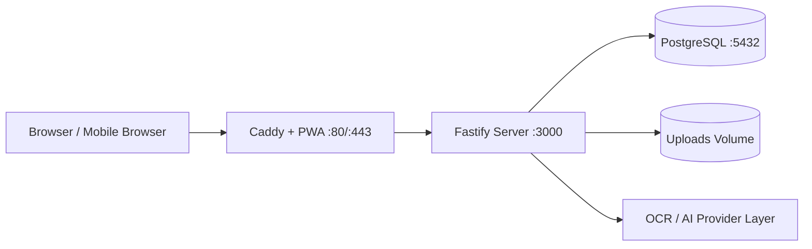
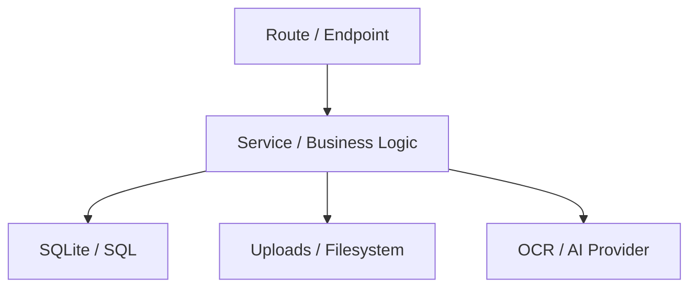
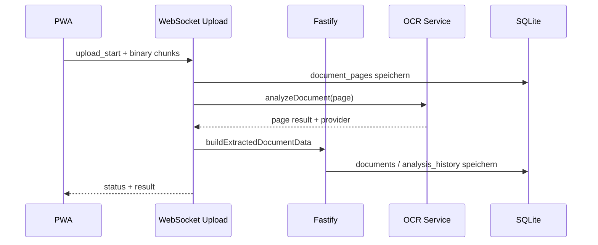
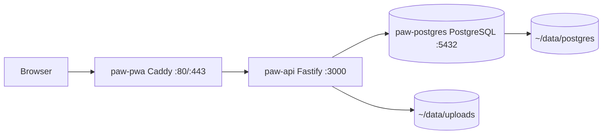

# PAWVAX Architecture

Stand: 2026-06-07

## Zweck

Dieses Dokument beschreibt die aktuell im Projekt verwendeten Architekturen. Es dokumentiert den Ist-Zustand des Systems, nicht eine Zielarchitektur.

## Architektur-Ueberblick

PAWVAX verwendet aktuell keine Microservice-Architektur. Das System ist ein klassisches Client-Server-System mit einem modularen Monolithen im Backend und einer separaten PWA im Frontend.

Aktuell verwendete Hauptarchitekturen:

- Zwei-Tier-System mit Browser-PWA und API-Backend
- Modularer Monolith im Backend
- SPA/PWA-Architektur im Frontend
- Layered Architecture mit Route-, Service- und Persistence-Schichten
- Hybride Kommunikationsarchitektur aus REST und WebSocket
- Relationale Datenarchitektur mit PostgreSQL plus JSON-Feldern fuer flexible OCR-Nutzdaten
- Rollen- und Freigabe-basierte Sicherheitsarchitektur
- Containerisierte Deployment-Architektur mit rootless Podman Quadlets (drei Container plus PostgreSQL)
- Deterministische API-Testarchitektur mit isoliertem Test-Runner

## 1. Systemarchitektur

### Form

Das System ist aktuell als verteiltes Drei-Komponenten-System aufgebaut:

- `paw-pwa`: Container mit Caddy, liefert die gebaute React-PWA aus und proxied zur API
- `paw-api`: Fastify-Server fuer REST, WebSocket, OCR, Auth, DB und Business-Logik
- `paw-postgres`: PostgreSQL 16 Datenbank-Container

### Laufzeit-Topologie

### Charakteristik

- Frontend und Backend sind getrennt deploybar.
- Das Backend ist die einzige schreibende Instanz fuer Geschaeftsdaten.
- SQLite und Upload-Verzeichnis sind persistente Infrastruktur des Backends.
- Externe AI-Provider sind optionale Integrationen, keine Pflichtkomponenten.

## 2. Frontend-Architektur

### Stil

Das Frontend ist eine Single Page Application mit PWA-Eigenschaften auf Basis von React, React Router, TypeScript und Vite.

### Aktuelle Bausteine

- React 18 als UI-Runtime
- React Router fuer seitenbasierte Navigation innerhalb der SPA
- Axios-basierte API-Abstraktion in `pwa/src/api/rest.ts`
- i18next fuer Lokalisierung
- Vite als Build-System
- `vite-plugin-pwa` fuer PWA-Auslieferung

### Architekturform im Frontend

Das Frontend ist aktuell seitenorientiert organisiert:

- `pages/` enthaelt die fachlichen Screens
- `components/` enthaelt wiederverwendbare UI-Bausteine
- `api/` kapselt Serverzugriffe
- `hooks/` kapseln Browser- und Geraeteintegration
- `utils/` enthaelt technische Hilfslogik
- `locales/` enthaelt Sprachdateien

### Routing-Architektur

Die Navigation ist aktuell zentral in `pwa/src/App.tsx` organisiert.

Routenbereiche:

- Oeffentliche Routen wie Welcome, Public Scan und Public Share
- Authentifizierte Tier-, Dokument-, Profil- und Reminder-Routen
- Admin-Routen mit gesondertem Guard

### UI-Navigationsarchitektur

Aktuell verwendet die PWA eine mobile Bottom-Navigation als primaeres Navigationsmuster.

- `BottomNav` wird fuer authentifizierte Sessions angezeigt
- Admin-Link wird rollenabhaengig eingeblendet
- Eine eigene Desktop-Sidebar-Architektur ist aktuell nicht die primaere Struktur

### Frontend-Kommunikationsschicht

Die Kommunikation zum Backend erfolgt ueber zwei Wege:

- REST fuer CRUD, Admin, Sharing, Profil, Reminder, Re-Analyse und Historie
- WebSocket fuer den seitenweisen Dokument-Upload mit Live-Statusmeldungen

### Frontend-Fehler- und Schutzarchitektur

- Globales `ErrorBoundary`-Pattern fuer Rendering-Fehler
- Axios-Interceptor fuer JWT-Injektion
- Axios-Interceptor fuer globales Logout bei `401`
- Route Guards ueber `RequireAuth`

## 3. Backend-Architektur

### Stil

Das Backend ist ein modularer Monolith auf Basis von Fastify.

Es ist kein Microservice-System, sondern eine einzige Runtime mit klar getrennten Funktionsmodulen.

### Modulare Gliederung

Aktuelle Hauptmodule:

- `routes/` fuer HTTP-Endpunkte
- `ws/` fuer WebSocket-Flows
- `services/` fuer OCR, Audit, Storage, Dedup und weitere fachnahe Logik
- `db/` fuer Schema und Initialisierung
- `utils/` fuer technische Hilfsfunktionen wie Kryptografie

### Schichtenmodell

Die aktuell sichtbare Schichtung ist:

### Route-zentrierte Fachmodule

Wichtige Route-Module sind aktuell:

- `auth.js`
- `animals.js`
- `documents.js`
- `admin.js`
- `organizations.js`
- `settings.js`
- `ai.js`
- `vetApi.js`
- `reminders.js`

### Backend-Charakteristik

- Transportlogik und fachliche Rechtepruefung liegen weitgehend in den Route-Modulen.
- Wiederverwendbare Kernlogik ist in Services ausgelagert.
- Die Persistenz wird ueber direkte SQL-Zugriffe mit dem `pg`-Treiber (PostgreSQL) umgesetzt.
- Das Backend vermeidet komplexe ORM-Abstraktionen und nutzt direktes SQL.

## 4. Kommunikationsarchitektur

### 4.1 REST-Architektur

REST ist der Standardkanal fuer die meisten Interaktionen.

Wichtige Bereiche:

- Authentifizierung und Session-nahe Aktionen
- Tierverwaltung
- Dokumentverwaltung
- Re-Analyse und Analyse-Historie
- Freigaben und oeffentliche Share-Links
- Admin-Funktionen
- Reminder
- Externe VET-API

### 4.2 WebSocket-Architektur

Der WebSocket-Kanal wird fuer den Dokument-Upload und Analysefortschritt verwendet.

Aktuelle Eigenschaften:

- JWT-basierte Authentifizierung im Socket-Protokoll
- Chunk-basierter Datei-Upload
- Multi-Page-Dokumentfluss
- Status-Events waehrend OCR/Analyse
- Persistierung in `document_pages` und `documents`

### 4.3 Hybride Interaktion

PAWVAX verwendet damit aktuell bewusst eine hybride Kommunikationsarchitektur:

- REST fuer transaktionale Abfragen und Aenderungen
- WebSocket fuer laenger laufende, interaktive Upload- und Analyseprozesse

## 5. Datenarchitektur

### Stil

Die persistente Datenarchitektur ist relational und basiert auf PostgreSQL 16.

### Kernmodell

Zentrale Tabellen sind aktuell:

- `accounts`
- `animals`
- `animal_tags`
- `documents`
- `document_pages`
- `analysis_history`
- `animal_sharing`
- `animal_public_shares`
- `animal_transfers`
- `verification_requests`
- `medical_administrations`
- `reminders`
- `audit_log`
- `api_keys`
- `test_results`

### Datenmodell-Strategie

Das Modell kombiniert zwei Ansatze:

- Normalisierte relationale Kerndaten fuer Accounts, Tiere, Rollen, Freigaben und Audit
- Flexible JSON-Payloads fuer OCR-Ergebnisse in `documents.extracted_json` und `analysis_history.extracted_json` (PostgreSQL JSONB)

### Vorteil dieser Hybridform

- Feste Geschaeftsobjekte bleiben relational abfragbar.
- Stark variierende OCR-Ausgaben koennen ohne hartes Tabellenmodell gespeichert werden.
- PostgreSQL JSONB erlaubt effiziente Indizes und Abfragen auf JSON-Feldern.
- Neue Dokumenttypen lassen sich schneller integrieren.

### Dokumentdaten-Architektur

Dokumente sind aktuell mehrschichtig modelliert:

- `documents` enthaelt Metadaten und aggregiertes `extracted_json`
- `document_pages` enthaelt einzelne Bildseiten
- `analysis_history` enthaelt versionierte Altanalysen

Diese Struktur unterstuetzt:

- Multi-Page-Dokumente
- OCR-Neuanalyse
- Historisierung
- UI-freundliche Aggregation strukturierter Daten

## 6. OCR- und Analysearchitektur

### Stil

Die OCR-Architektur ist eine providerfaehige Analysepipeline mit Fallback und strukturierter Dokumentklassifikation.

### Ablauf

### Aktuelle Eigenschaften

- Dokumenttyp-Klassifikation vor Detail-Extraktion
- Typ-spezifische Extraktionsprompts fuer Vaccination, Treatment und weitere Typen
- Aggregation mehrerer Seiten zu einem konsistenten Dokument-JSON
- Provider-Auswahl ueber Nutzer- oder Systemkonfiguration
- Fallback-Mechanik, wenn kein externer AI-Key vorhanden ist

### Provider-Architektur

Der OCR-Service ist aktuell als Adapter-artige Integrationsschicht aufgebaut:

- Google/Gemini
- Anthropic/Claude
- OpenAI
- deterministisches Mock-OCR fuer Tests

### Besondere Architekturentscheidung

Mock-OCR ist absichtlich strikt auf Testbetrieb begrenzt:

- nur bei `NODE_ENV=test`
- nur bei `PAW_MOCK_OCR=1`

Damit ist Testbarkeit vorhanden, ohne Produktionspfade zu verfaelschen.

## 7. Sicherheitsarchitektur

### Authentifizierung

Aktuell werden drei Sicherheitsmechanismen verwendet:

- JWT fuer normale Benutzer-API
- Token-Blacklist fuer Logout/Revocation
- API-Key-Authentifizierung fuer die externe VET-API

### Autorisierung

Die Autorisierung ist mehrstufig:

- globale Route-Guards fuer geschuetzte Bereiche
- rollenbasierte Rechtepruefung in Endpunkten
- dokument- und tierbezogene Sichtbarkeitsregeln
- eigentuemer- und uploader-bezogene Mutationsrechte

### Rollenmodell

Aktuell verwendete Rollen:

- `guest`
- `user`
- `vet`
- `authority`
- `admin`

### Freigabe-Architektur

PAWVAX kombiniert Rollen- und Objektfreigaben:

- `animal_sharing` steuert, welche Metadaten pro Rolle sichtbar sind
- `documents.allowed_roles` steuert Dokumentsichtbarkeit je Rolle
- `animal_public_shares` steuert zeitlich begrenzte oeffentliche Links

### Weitere Schutzmechanismen

- CORS-Konfiguration
- Helmet/CSP-Hardening
- globales Rate-Limit
- separates Rate-Limit fuer VET-API-Endpunkt
- strukturierte Request- und Fehlerlogs
- Audit-Logging fuer sicherheitsrelevante Aktionen

## 8. Audit- und Beobachtbarkeitsarchitektur

### Logging

Das Backend nutzt Fastify-Logging als strukturierte Logging-Basis.

Aktuell vorhanden:

- Request/Response-Logging im `onResponse`-Hook
- globaler Error-Handler
- OCR-spezifischer Logger ueber `setOcrLogger(...)`
- Audit-Logging fuer fachliche Aenderungen und HTTP-Fehler

### Audit-Trail

Die Tabelle `audit_log` bildet die fachliche Nachvollziehbarkeit.

Aktuell werden dort unter anderem erfasst:

- Uploads
- Dokumentaenderungen
- Freigabeaenderungen
- Admin-Aktionen
- HTTP-Fehler mit Benutzerbezug

### Retention

- Audit-Logs werden aktuell per einfacher Retention-Policy nach 90 Tagen bereinigt.

## 9. Externe Integrationsarchitektur

### AI-Provider

Die AI-Integration ist lose gekoppelt und konfigurierbar:

- systemweite oder nutzerspezifische Tokens
- nutzerspezifische Modellpraeferenzen
- Provider-Prioritaeten

### Externe VET-API

Die externe VET-API ist aktuell als separater REST-Einstieg im gleichen Backend vorhanden.

Aktueller Endpunkt:

- `POST /api/v1/animals/:animalId/documents`

Eigenschaften:

- API-Key ueber `X-Api-Key`
- SHA-256-Hash-Abgleich gegen `api_keys`
- nur fuer verifizierte Vet-Accounts
- separates Rate-Limit
- schreibt importierte Dokumente direkt in `documents`

### Oeffentliche Zugriffspfade

Zusatzlich zur internen App gibt es zwei oeffentliche Zugriffsmuster:

- Public Tag Scan
- Public Share Link

## 10. Deployment-Architektur

### Stil

Das Deployment ist containerisiert mit rootless Podman Quadlets auf einem einzelnen Hetzner-Server.

### Container und Quadlets

Drei Quadlet-Definitionen unter `podman/`:

| Container | Image | Port | Rolle |
|-----------|-------|------|-------|
| `paw-postgres` | postgres:16-alpine | 5432 | PostgreSQL-Datenbank |
| `paw-api` | localhost/paw-api | 3000 | Fastify REST/WebSocket API |
| `paw-pwa` | localhost/paw-pwa | 80/443 | Caddy + React-PWA |

Startreihenfolge: `paw-postgres` → `paw-api` → `paw-pwa` (Requires/After in Quadlets definiert).

### Build- und Laufzeitstruktur

- Backend: Node 22 Alpine Container, `paw-api`
- Frontend: Multi-Stage-Build mit Node fuer Build, Caddy fuer Auslieferung und Reverse-Proxy, `paw-pwa`
- Datenbank: PostgreSQL 16 Alpine, `paw-postgres`
- Persistenz: `~/data/uploads` Volume fuer Uploads, `~/data/postgres` fuer DB-Daten

### Health Checks

- `paw-api`: `wget http://localhost:3000/health` (10s Intervall)
- `paw-pwa`: Port :8080 (Caddy-Metrik-Endpoint)
- `paw-postgres`: `pg_isready -U pawvax`

### Quadlet-Architektur

### Charakteristik

- Rootless Podman, kein Root noetig, kein Docker-Daemon
- Systemd-Integration ueber Quadlets (automatischer Start, Restart)
- Kein Compose-File oder Orchestrator noetig
- Single-Node-Deployment geeignet fuer MVP bis mittlere Last
- State liegt in persistenten Host-Volumes (`~/data/`)

## 11. Testarchitektur

### Stil

Die Testarchitektur ist aktuell backendzentriert und API-orientiert.

### Bausteine

- eigener Node-Test-Runner in `server/scripts/run-api-tests.js`
- Jest-basierte API-Suite
- isolierte Testumgebung mit temporaerer DB und Upload-Struktur
- Persistierung von Testreports in `test_results`

### Strategische Eigenschaften

- Fokus auf End-to-End-nahe API-Regressionstests
- Autorisierungs- und Statuscode-Abdeckung
- deterministische OCR-Tests ueber Mock-OCR
- Admin-Auswertung von Testergebnissen ueber API

## 12. Aktuelle Architekturentscheidungen

Die wichtigsten derzeit sichtbaren Architekturentscheidungen sind:

- Modularer Monolith statt Microservices
- PostgreSQL 16 als persistente Datenbank (migriert von SQLite)
- React SPA/PWA statt SSR-Frontend
- REST plus WebSocket statt reinem Polling
- JSONB-basierte OCR-Payloads statt voll normalisiertem Dokumenttabellenmodell
- Direkte SQL-Zugriffe statt ORM
- Rootless Podman Quadlets statt Docker Compose oder Kubernetes

## 13. Bekannte Architekturgrenzen

Aktuell erkennbare Grenzen des Ist-Zustands:

- OCR, API und Dateiverarbeitung laufen in derselben Backend-Runtime.
- Ein dedizierter Background-Job- oder Queue-Layer ist aktuell nicht vorhanden.
- Die Frontend-Navigation ist primaer mobilzentriert und nicht als vollstaendige Desktop-Shell ausgepraegt.
- OCR-Ergebnisse werden flexibel als JSON gespeichert; komplexe Ad-hoc-Abfragen erfordern PostgreSQL-JSONB-Funktionen.

## 14. Zusammenfassung

PAWVAX ist aktuell ein pragmatisch aufgebautes, containerisiertes Client-Server-System mit einer React-PWA und einem Fastify-basierten modularen Monolithen. Die Architektur verbindet klassische CRUD-Flows mit dokumentzentrierter OCR-Verarbeitung, Rollen- und Freigabelogik, Auditierbarkeit, einer kleinen externen VET-API und einer testbaren Re-Analyse-Pipeline.

Fuer den aktuellen Produktstand ist die Architektur klar, konsistent und auf ueberschaubare Betriebs- und Entwicklungs-Komplexitaet optimiert.
