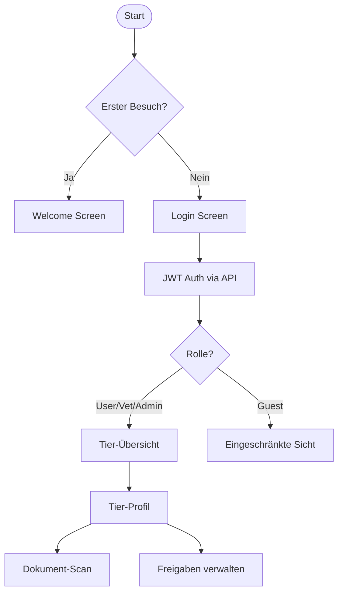
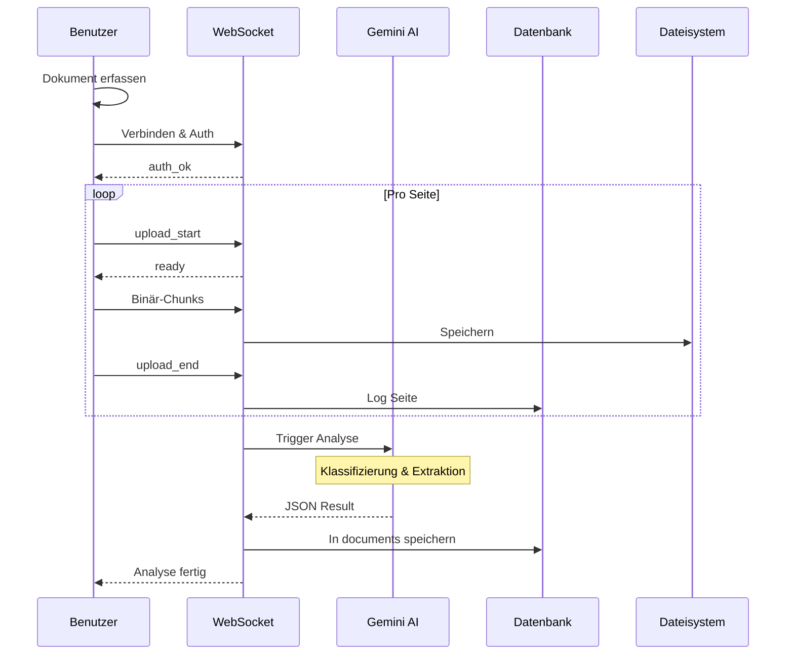
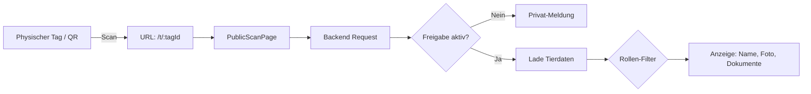
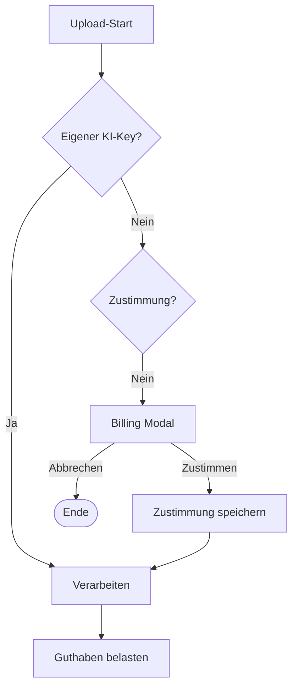

# PAW — PWA Workflow Dokumentation

Diese Dokumentation beschreibt die zentralen fachlichen und technischen Abläufe der PAW Progressive Web App (PWA).

---

## 1. Einstieg & Authentifizierung

### Beschreibung
1.  **Welcome & Login**: Neue Benutzer werden begrüßt, bestehende loggen sich via JWT ein.
2.  **Rollen-Guard**: Das System prüft die Rolle (`user`, `vet`, `authority`, `guest`, `admin`) und schaltet entsprechende Menüpunkte frei.
3.  **Tier-Zentralisierung**: Der Hauptfokus liegt auf der Liste der Tiere (`AnimalsPage`), von der aus alle weiteren Aktionen (Scans, Details, Freigaben) starten.

---

## 2. Dokument-Upload & KI-Analyse

### Prozess-Details
-   **Multi-Page Support**: Benutzer können mehrere Seiten fotografieren, die serverseitig zu einem Dokument zusammengefügt werden.
-   **Live-Feedback**: Der WebSocket überträgt Statusmeldungen direkt in die UI.
-   **Daten-Hybrid**: Die Ergebnisse landen als strukturiertes JSON in der Datenbank.

---

## 3. Notfall-Scan & Öffentliche Freigabe

### Besonderheiten
-   **Zero Friction**: Kein Login erforderlich.
-   **Datenschutz**: Besitzer entscheidet über Zugriff pro Rolle.

---

## 4. Abrechnung (Billing) & KI-Zustimmung

---

## 5. Rollen-Matrix
| Rolle | Sichtbarkeit | Schreibrechte |
| :--- | :--- | :--- |
| **Owner** | Alle eigenen Tiere/Docs | Vollzugriff |
| **Vet** | Freigegebene Daten | Kann verifizierte Docs erstellen |
| **Authority** | Impfstatus & Identität | Nur Lesezugriff |
| **Guest** | Basis-Infos (Notfall) | Keine Schreibrechte |
| **Admin** | Systemweit | Volle Konfiguration |
