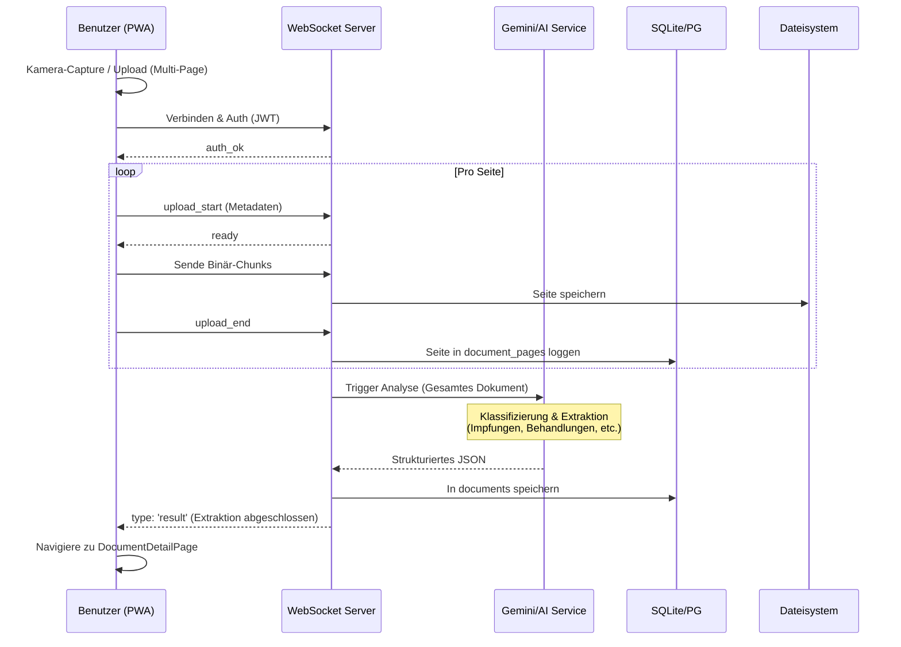
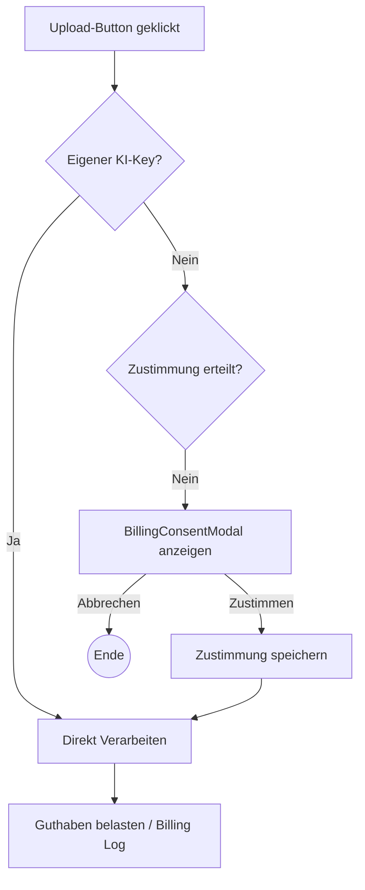

# PAW — PWA Workflow Dokumentation

Diese Dokumentation beschreibt die zentralen fachlichen und technischen Abläufe der PAW Progressive Web App (PWA).

---

## 1. Einstieg & Authentifizierung
Der Benutzer-Lifecycle beginnt entweder mit einer öffentlichen Ansicht (Public Scan) oder dem Login in den geschützten Bereich.

### Ablaufdiagramm
```mermaid
graph TD
    Start((Start)) --> Welcome{Erster Besuch?}
    Welcome -- Ja --> WelcomePage[Welcome Screen]
    Welcome -- Nein --> LoginPage[Login Screen]
    
    LoginPage --> Auth[JWT Auth via API]
    Auth --> RoleCheck{Rolle?}
    
    RoleCheck -- User/Vet/Admin --> AnimalsPage[Tier-Übersicht]
    RoleCheck -- Guest --> PublicScan[Eingeschränkte Sicht]
    
    AnimalsPage --> PetDetails[Tier-Profil]
    PetDetails --> DocScan[Dokument-Scan]
    PetDetails --> Sharing[Freigaben verwalten]
    
    subgraph Navigation (Mobile Bottom Nav)
        ScanBtn[QR/NFC Scan]
        PetsBtn[Meine Tiere]
        ProfileBtn[Profil/Settings]
        AdminBtn[Admin Panel - nur Admin]
    end
```

### Beschreibung
1.  **Welcome & Login**: Neue Benutzer werden begrüßt, bestehende loggen sich via JWT ein.
2.  **Rollen-Guard**: Das System prüft die Rolle (`user`, `vet`, `authority`, `guest`, `admin`) und schaltet entsprechende Menüpunkte frei.
3.  **Tier-Zentralisierung**: Der Hauptfokus liegt auf der Liste der Tiere (`AnimalsPage`), von der aus alle weiteren Aktionen (Scans, Details, Freigaben) starten.

---

## 2. Dokument-Upload & KI-Analyse
Der Kernprozess zur Digitalisierung von Tierarzt-Dokumenten. Er nutzt eine hybride Kommunikation (WebSocket für den Upload und REST für manuelle Re-Analysen).

### Sequenzdiagramm


### Prozess-Details
-   **Multi-Page Support**: Benutzer können mehrere Seiten fotografieren, die serverseitig zu einem Dokument zusammengefügt werden.
-   **Live-Feedback**: Der WebSocket überträgt Statusmeldungen ("Analysiere mit Gemini...", "Extrahiere Daten...") direkt in die UI.
-   **Daten-Hybrid**: Die Ergebnisse landen als strukturiertes JSON in der Datenbank, um flexibel auf verschiedene Dokumenttypen (Impfpass, Laborbefund) reagieren zu können.

---

## 3. Notfall-Scan & Öffentliche Freigabe
Dieser Ablauf ermöglicht es Drittpersonen, Informationen über ein Tier via NFC-Tag oder QR-Code abzurufen.

### Ablaufdiagramm
```mermaid
graph LR
    Tag[Physischer Tag / QR] -- Scan --> URL[URL: /t/:tagId]
    URL --> PublicPage[PublicScanPage]
    
    PublicPage --> API[Backend Request]
    API --> CheckShare{Freigabe aktiv?}
    
    CheckShare -- Nein --> Error[Privat-Meldung]
    CheckShare -- Ja --> FetchData[Lade Tierdaten & Docs]
    
    FetchData --> Filter{Rollen-Filter}
    Note right of Filter: Nur Dokumente mit<br/>passender 'allowed_roles'
    
    Filter --> Display[Anzeige: Name, Foto, Verifizierte Dokumente]
```

### Besonderheiten
-   **Zero Friction**: Kein Login für die scannende Person erforderlich.
-   **Datenschutz**: Der Besitzer entscheidet pro Tier und pro Dokument, welche Rollen (z.B. `guest` oder `authority`) Zugriff haben.
-   **Identifikation**: Unterstützt NFC-Chips (ISO15693/Ndef), QR-Codes und manuelle Chip-Nummern.

---

## 4. Abrechnung (Billing) & KI-Zustimmung
Wenn der Benutzer keine eigenen KI-Keys (Gemini/OpenAI) hinterlegt hat, wird das systemweite KI-Guthaben genutzt.

### Ablaufdiagramm


### Details
-   **Transparenz**: Vor dem Upload wird der Preis pro Seite angezeigt, wenn das System-Fallback aktiv ist.
-   **Flexibilität**: Nutzer können im Profil eigene API-Keys hinterlegen, um die Kosten direkt mit den Providern abzurechnen.

---

## 5. Administration & System-Konfiguration
Admins steuern das "Look & Feel" und die technischen Parameter der gesamten Instanz.

### Ablauf
1.  **Settings**: Über das Admin-Panel werden App-Name, Logo und Theme-Farbe geändert.
2.  **Echtzeit-Anpassung**: Die PWA ruft beim Start `/api/settings` auf und injiziert die CSS-Variablen für das Branding dynamisch.
3.  **Verifizierung**: Admins können Tierarzt-Accounts prüfen und den "Verified"-Status vergeben, der später das Badge an den Dokumenten steuert.

---

## 6. Rollen-Matrix
| Rolle | Sichtbarkeit | Schreibrechte |
| :--- | :--- | :--- |
| **Owner** | Alle eigenen Tiere/Docs | Vollzugriff auf eigene Daten |
| **Vet** | Freigegebene Gesundheitsdaten | Kann verifizierte Dokumente für Patienten erstellen |
| **Authority** | Impfstatus & Identität | Nur Lesezugriff (für Kontrolle) |
| **Guest** | Nur Basis-Infos (Notfall) | Keine Schreibrechte |
| **Admin** | Systemweit | Volle Konfiguration & Benutzerverwaltung |
