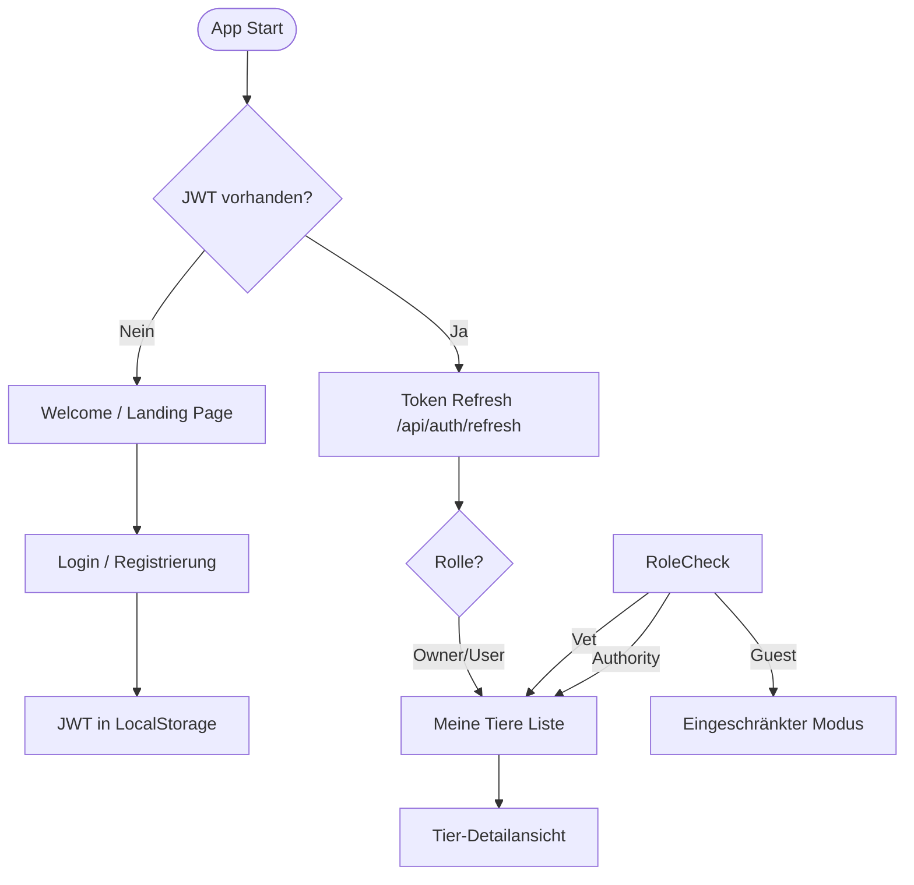
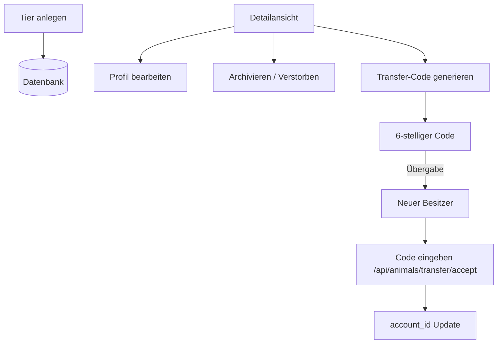
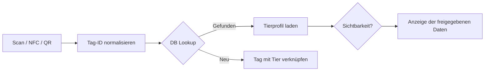
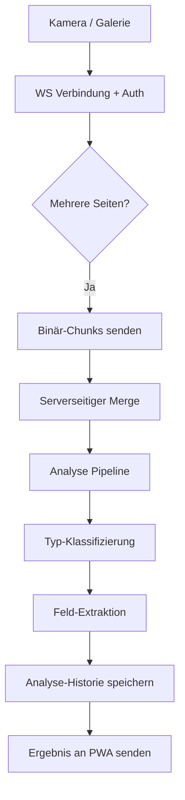
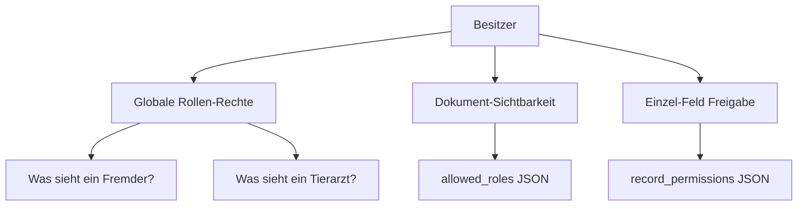
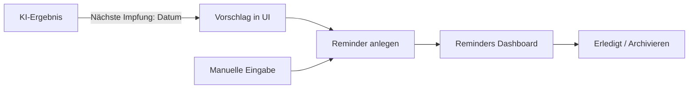
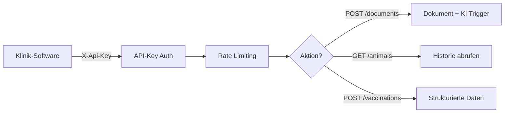
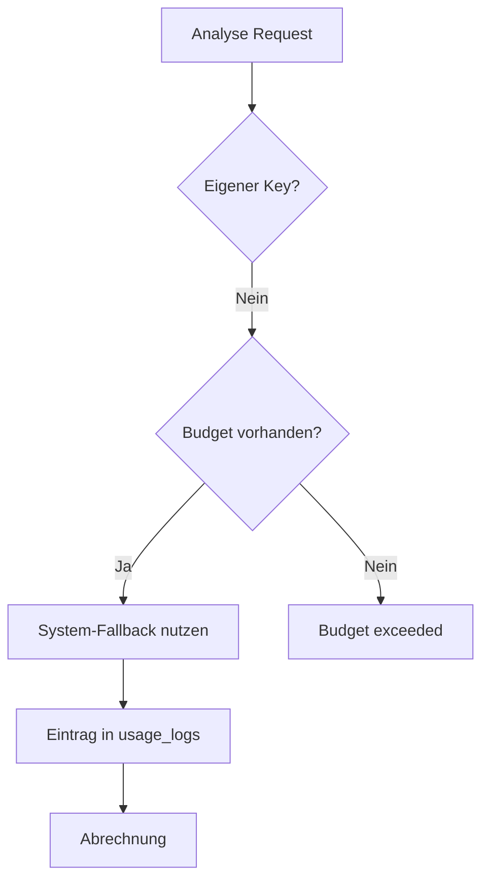
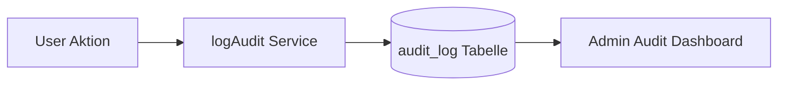

# PAW — Detaillierte Workflow-Architektur

Diese Dokumentation bietet einen vollständigen Überblick über alle technischen und fachlichen Prozesse des PAW-Systems.

---

## 1. Benutzer-Lifecycle & Zugriffskontrolle

Der Einstieg erfolgt über die PWA, die je nach Authentifizierungsstatus und Rolle unterschiedliche Funktionen freischaltet.

### Rollen-Matrix & Berechtigungen
- **Owner**: Volle Kontrolle über eigene Tiere und Dokumente.
- **Vet**: Kann Dokumente für gescannte Tiere hinzufügen (Verified Badge).
- **Authority**: Lesezugriff auf Gesundheitsdaten für Kontrollen.
- **Admin**: Systemkonfiguration, User-Verifizierung und Billing-Management.

---

## 2. Tier-Management (CRUD & Transfer)

Besitzer können Tiere anlegen, verwalten und sicher an andere Benutzer übertragen.

---

## 3. Identifikation: NFC, QR & Chip

Die Identifikation erfolgt über drei Kanäle, die physische Tags mit digitalen Profilen verknüpfen.

### Tag-Typen
- **NFC**: Native Browser-NFC API (NDEF) zum Lesen und Beschreiben.
- **Barcode/QR**: Kamera-basiertes Scanning (html5-qrcode).
- **Chip**: Manuelle Eingabe oder Extraktion aus dem Heimtierausweis via KI.

---

## 4. Dokumenten-Pipeline & KI-Analyse

Der technisch anspruchsvollste Prozess: Upload über WebSockets mit Live-KI-Feedback.

### KI-Features
- **Multi-Provider**: Wahl zwischen Gemini, Claude und OpenAI.
- **Re-Analyze**: Bestehende Dokumente mit neuen Modellen/Prompts neu auswerten.
- **Versioning**: Jede Analyse wird historisiert (`analysis_history`).

---

## 5. Privacy-Engine & Granulare Freigaben

PAW nutzt ein mehrstufiges Freigabesystem: Global (per Rolle) und Pro Dokument.

---

## 6. Smart Reminders (Erinnerungen)

Erinnerungen werden entweder manuell erstellt oder direkt aus KI-Ergebnissen abgeleitet.

---

## 7. Veterinary API (VET-API)

Schnittstelle für externe Klinik-Systeme zum automatisierten Datenaustausch.

---

## 8. Billing & Ressourcen-Management

Verwaltung der KI-Kosten und System-Budgets.

---

## 9. Audit & Nachvollziehbarkeit

Jede sicherheitsrelevante Aktion wird unveränderlich protokolliert.

**Protokollierte Aktionen:**
- Logins / Fehlschläge
- Dokument-Uploads & Löschungen
- Freigabe-Änderungen
- Admin-Eingriffe
- API-Zugriffe
